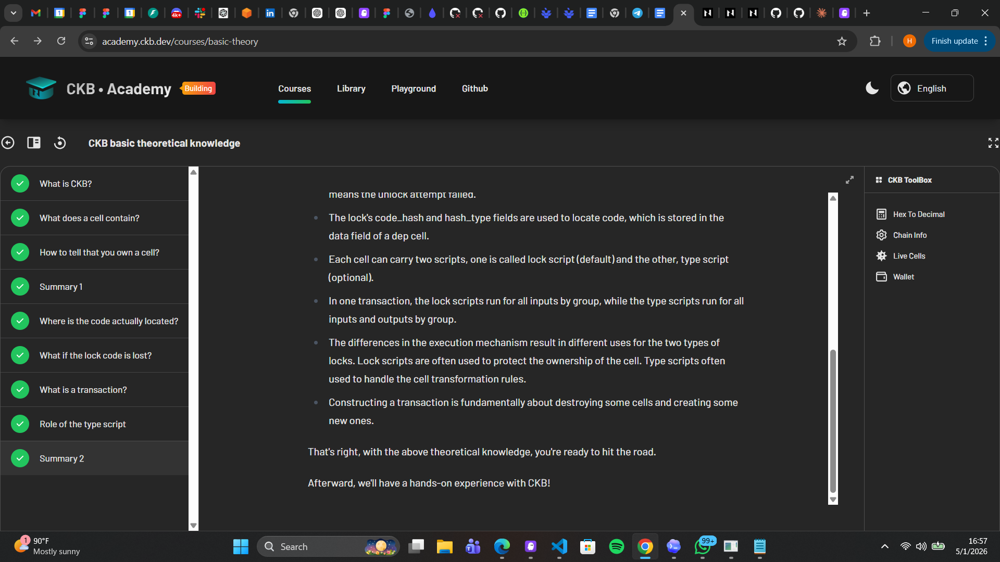
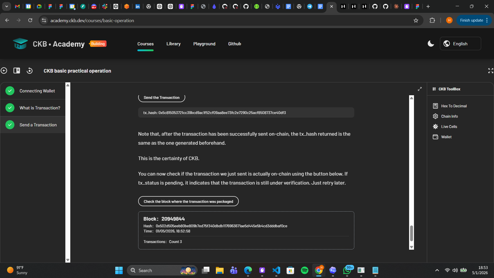

# Week 1 — May 1–8 2026

First week of the CKBuilder program. Focused on getting the environment set up and working through the foundational CKB concepts before jumping into actual script development.

## What I Did

### Environment Setup
- Installed Rust with the `riscv64imac-unknown-none-elf` target for RISC-V compilation
- Installed LLVM/Clang for cross-compilation
- Installed `ckb-cli` and connected it to a CKB node
- Set up `cargo-generate` with the `ckb-script-templates` workspace template

### CKB Academy — Lesson 1
Covered the core theory behind CKB:
- What CKB is and how it fits into the Nervos ecosystem
- What a cell contains (capacity, data, lock, type)
- How ownership works — the lock script determines who can spend a cell
- Where lock/type script code actually lives (cell deps)
- What happens if lock code is lost
- What a transaction is — consuming inputs and creating outputs
- The role of the type script in enforcing data rules

### CKB Academy — Lesson 2
More practical, wallet-focused lesson:
- Connecting a wallet to CKB
- What a transaction looks like in practice
- Sending a transaction hands-on — building, signing, and broadcasting

### ckb-rust-script
First hands-on project using the `ckb-script-templates` workspace. Built two beginner contracts:
- **hello-world** — prints "Hello World!" via the debug syscall
- **simple-print-args** — loads the script's args and prints their length and hex content

These were mostly about getting comfortable with the `ckb-std` crate, the `no_std` environment, and the RISC-V build pipeline.

### Carrot Validator
Built a type script that rejects any transaction where an output cell's data starts with the word `"carrot"`. Key things practiced:
- Reading cell data with `load_cell_data` and `Source::GroupOutput`
- Custom error enums with `#[repr(i8)]`
- Writing tests with `ckb-testtool` — both a passing case and an expected-failure case
- Cross-compiling to RISC-V and running the binary through the CKB-VM in tests

### sUDT Script
Implemented a Simple UDT (User Defined Token) script following the sUDT standard:
- **Owner mode**: script args of 32 bytes allow token issuance (returns success immediately)
- **Transfer mode**: validates that total input token amounts ≥ total output token amounts
- Used `Source::GroupInput` and `Source::GroupOutput` to scope iteration to matching type scripts only
- Token amounts stored as little-endian `u128` in cell data
- Wrote two test cases: normal transfer (400 → 300 + 100) and owner mode minting

## Projects

| Project | Description |
|---------|-------------|
| [ckb-rust-script](https://github.com/Hallab7/ckb-rust-script) | Hello world and print-args beginner contracts |
| [ckb-carrot-validator-contract](https://github.com/Hallab7/ckb-carrot-validator-contract) | Carrot validator — rejects cells with carrot data |
| [ckb-sudt-script](https://github.com/Hallab7/ckb-sudt-script) | sUDT token script with owner mode and transfer validation |

## Projects Link

- ckb-rust-script: https://github.com/Hallab7/ckb-rust-script
- ckb-carrot-validator-contract: https://github.com/Hallab7/ckb-carrot-validator-contract
- ckb-sudt-script: https://github.com/Hallab7/ckb-sudt-script

## Key Concepts Learned

- What CKB is and its place in the Nervos ecosystem
- Cell structure: capacity, data, lock script, type script
- Lock scripts control ownership — if the code is lost, the cell is unspendable
- Script code lives in other cells, referenced via cell deps
- Transactions consume input cells and create output cells
- Type scripts enforce rules on how cell data can change
- CKB's RISC-V execution environment and the CKB-VM
- `Source::GroupInput` / `Source::GroupOutput` scopes iteration to cells sharing the same script
- How to write `no_std` Rust for a constrained blockchain environment
- Cross-compiling to `riscv64imac-unknown-none-elf` and testing with `ckb-testtool`

## Cycle Counts

| Contract | Cycles |
|----------|--------|
| Carrot validator (no carrot) | ~12,902 |
| sUDT transfer | ~29,558 |
| sUDT owner mode | ~38,424 |
