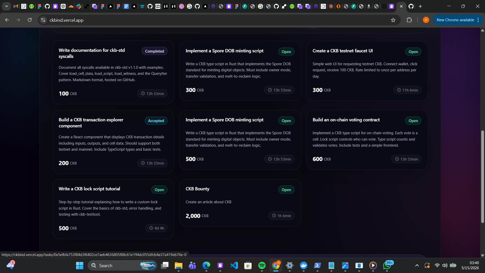

# Week 2 — May 9–15 2026

Second week of the CKBuilder program. Building a real full-stack CKB application — an on-chain task marketplace where rewards are escrowed in cells and released atomically when work is approved.

## What I Did

### Designed the Project

ckecked 30 CKB-native project ideas form one of the community developer and picked one that best fits the current skill level and demonstrates CKB's core properties: the **CKB Actions Marketplace** — an on-chain task board where every task is a cell, every reward is locked on-chain, and no platform holds funds at any point.

Key design decisions:
- No backend database — CKB cells are the state
- Two scripts: a type script for state machine logic, a lock script for spending authorization
- Five task states: open → accepted → submitted → completed / disputed

### Built the On-chain Scripts (Rust)

Implemented two RISC-V scripts using `ckb-std`:

**task-type** — enforces the state machine:
- Handles creation (no input group cell → validates output is STATUS_OPEN)
- Validates every state transition: open→claimed, claimed→submitted, submitted→completed/disputed, disputed→open/completed
- Ensures reward and deadline are immutable once set
- Verifies the correct party signed each transition via input lock hash matching

**task-lock** — controls who can spend the task cell:
- Open: anyone can claim (type script validates), only poster can cancel
- Claimed: only worker can unlock (to submit)
- Submitted: reviewer or worker can act
- Completed: only worker can claim reward
- Disputed: poster or reviewer can resolve

### Deployed Scripts to Testnet

Stripped debug symbols, deployed both scripts to CKB testnet using `ckb-cli deploy`:

| Script | Code Hash | Tx |
|--------|-----------|-----|
| task-type | `0xa822599c...dafe` | `0x85db3ca9...84f0` |
| task-lock | `0xc8c01f16...9349` | `0x8348906a...214c` |
| dep-group | — | `0x03d149bf...9d1a` |

### Built the Frontend (Next.js + CCC SDK)

Built a full frontend connected to the deployed scripts:

**Pages:**
- Browse — live task grid loaded from the CKB indexer, search and status filters, stats bar
- Post Task — form with on-chain transaction, block-to-time converter, "Use mine" button for reviewer address
- Task Detail — progress steps, action buttons per role (accept/submit/approve/reject/cancel), tx hash with explorer link
- Dashboard — wallet-gated, shows posted and claimed tasks with CKB stats

**Key integrations:**
- CCC SDK (`@ckb-ccc/connector-react`) for wallet connection and transaction building
- `client.findCells()` to query task cells from the indexer by lock script
- Transaction builders for all 6 actions (post, accept, submit, approve, reject, cancel)
- Cell data codec matching the exact byte layout the Rust scripts expect
- Block-to-human time converter (10s/block → min/h/d format)

### Deployed to Vercel

Live at [https://ckbind.vercel.app](https://ckbind.vercel.app)

## Projects

| Project | Description | Link |
|---------|-------------|------|
| ckb-actions-marketplace | On-chain task board — scripts + frontend | [GitHub](https://github.com/Hallab7/ckb-actions-marketplace) |
| Live app | Deployed on Vercel, connected to CKB testnet | [ckbind.vercel.app](https://ckbind.vercel.app) |

## Key Concepts Learned

- How to design a state machine using CKB type scripts
- The difference between lock script authorization and type script validation
- How `Source::GroupInput` / `Source::GroupOutput` scope execution to matching scripts
- Handling the creation case in a type script (no input group cell → `IndexOutOfBound`)
- Deploying scripts with `ckb-cli deploy` — config, gen-txs, sign, apply
- Stripping RISC-V binaries with `llvm-objcopy` before deployment (20MB → 42KB)
- Using CCC SDK to build and send CKB transactions from a Next.js frontend
- Encoding/decoding cell data in TypeScript to match Rust byte layouts exactly
- Querying live cells from the CKB indexer by script prefix

## Cycle Counts

| Action | Cycles |
|--------|--------|
| Post task (creation) | ~38,000 |
| Claim task | ~42,000 |
| Submit proof | ~40,000 |
| Approve task | ~44,000 |
| Reject task | ~43,000 |
| Cancel task | ~29,000 |
