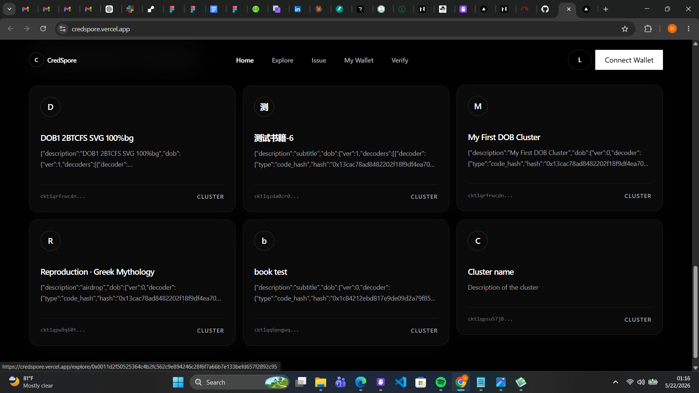

# Week 3 — May 16–22 2026

Third week of the CKBuilder program. Built a second full-stack CKB application — an on-chain verifiable credential system using the Spore Protocol's DOB standard.

## What I Did

### Designed the Project

Researched the Spore Protocol and picked **DOB Credential & Badge Protocol** as the week's project — a system for issuing verifiable credentials as Spore DOBs on CKB. Each credential is a cell owned by the holder, backed by locked CKB, and verifiable by anyone reading the chain.

Key design decisions:
- No custom Rust scripts — Spore Protocol is already deployed on testnet/mainnet
- Two cell types: Spore Cluster (credential type/schema) and Spore DOB (individual credential)
- Credentials are immutable once issued, meltable by the holder to reclaim CKB
- Content stored as JSON in the Spore cell's data field

### Learned the Spore Protocol

Studied how Spore works on CKB:
- **Cluster cell** — defines a credential type (name + description), owned by the issuer
- **Spore cell** — the actual credential, references a Cluster via `clusterId`, owned by the recipient
- **Melt-to-reclaim** — holder can destroy the Spore cell to get back the locked CKB capacity
- **Immutability** — all Spore cell fields are immutable once created
- **Zero-fee transfers** — Spore cells can be transferred without gas fees

Discovered that Spore has multiple versions (v1, v2) and a DOB/0, DOB/1 protocol family for generative art — important for handling clusters created by other developers on testnet.

### Built the Core Library

Implemented the full TypeScript library using `@ckb-ccc/spore`:

**`lib/transactions.ts`** — all on-chain actions:
- `createCredentialType()` — creates a Spore Cluster
- `issueCredential()` — mints a Spore DOB to a recipient using `clusterCell` mode
- `meltCredential()` — holder reclaims locked CKB
- `transferCredential()` — sends credential to another address
- Fixed MetaMask fee rate issue by calling `completeFeeBy(signer, 1000)` after SDK builds the tx

**`lib/indexer.ts`** — all chain queries:
- `getCredentialsByHolder()` — all credentials at an address
- `getCredentialsByType()` — all credentials under a cluster
- `getCredentialType()` — single cluster by ID (scans all clusters, handles v1/v2/DOB encoding)
- `getAllCredentialTypes()` — browse all clusters on testnet (limit 200)
- `getMyCredentials()` / `getMyCredentialTypes()` — signer-scoped queries

**`lib/types.ts`** — shared types and JSON codec for credential content

### Built the Frontend (Next.js + CCC + Spore SDK)

**Pages:**
- `/` — Home with how-it-works steps and recent credential types (own clusters pinned first)
- `/explore` — Browse all clusters on testnet, own clusters shown first when connected
- `/explore/[clusterId]` — Cluster detail with issued credentials list
- `/credentials/[sporeId]` — Credential detail with melt and transfer actions
- `/issue` — Create a new credential type (Cluster)
- `/issue/[clusterId]` — Mint credentials to recipients with metadata support
- `/wallet` — My held credentials + my created types, with melt/transfer
- `/verify` — Public verifier: paste any address, see their credentials

### Debugging Challenges

Several non-trivial issues encountered and resolved:

- **MetaMask fee rate error** — Spore SDK doesn't call `completeFeeBy` correctly for MetaMask signers; fixed by calling it explicitly at 1000 shannons/byte
- **`clusterMode` undefined error** — `createSpore` requires explicit `clusterMode` when a `clusterId` is provided; switched to `clusterCell` mode
- **DOB/1 cluster decode error** — testnet has many Spore clusters using DOB/1 generative art encoding that fails `unpackToRawClusterData`; fixed with try/catch fallback and graceful UI
- **Own cluster not showing** — `getAllCredentialTypes` had a limit of 50 which was too low; increased to 200 and added `getMyCredentialTypes` to always pin own clusters first

## Projects

| Project | Description | Link |
|---------|-------------|------|
| ckb-dob-credentials | On-chain credential system using Spore Protocol | [GitHub](https://github.com/Hallab7/ckb-dob-credentials) |
| Live app | Deployed on Vercel, connected to CKB testnet | [credspore.vercel.app](https://credspore.vercel.app) |

## Key Concepts Learned

- Spore Protocol: Cluster cells, Spore DOB cells, melt-to-reclaim economics
- Difference between Spore v1, v2, and DOB/0, DOB/1 encoding formats
- `clusterCell` vs `lockProxy` vs `skip` modes for Spore minting
- Why you can only issue credentials against clusters you own (lock script authorization)
- Using `@ckb-ccc/spore` SDK — `createSporeCluster`, `createSpore`, `meltSpore`, `transferSpore`
- Using `findSpores`, `findSporeClusters`, `findSporesBySigner` for indexer queries
- Decoding Spore cell data with `unpackToRawSporeData` and `unpackToRawClusterData`
- Handling async generator errors in TypeScript (`for await` with per-iteration try/catch)
- MetaMask fee rate differences vs JoyID on CKB transactions
